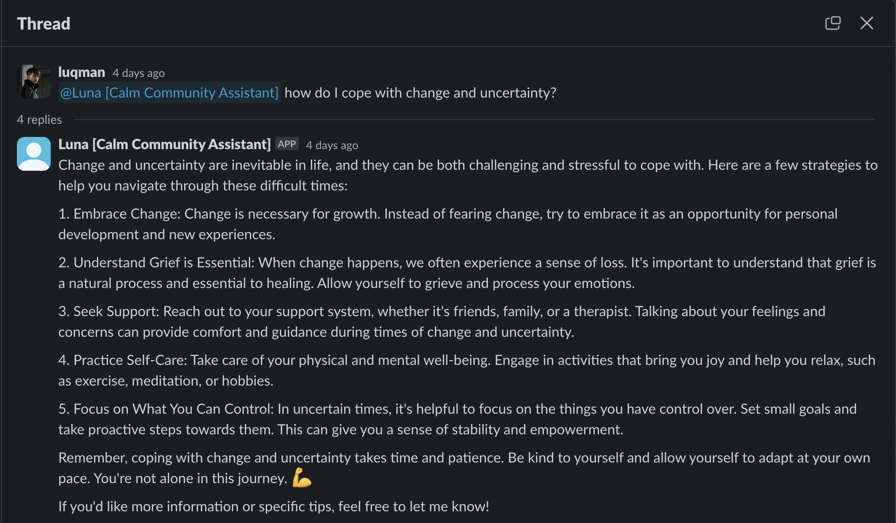

# Calm Collective Community Manager

## 📖 Introduction

An exploration into the possibilty of a fully autonomous Community Manager using [langchain](https://www.langchain.com). /ask, @mention or send a direct message on Slack to ask for mental health tips, find helpful articles or links to our talks.

## 🛠️ Setup & Configuration

1. Ensure required libraries are installed:
```
pip install requirements.txt
```
2. Setup api keys in .env:
```
OPENAI_API_KEY="XXX"
SERP_API_KEY="XXX"
BROWSEAI_API_KEY="XXX"
BROWSERLESS_API_KEY="XXX"
SLACK_APP_TOKEN="XXX"
SLACK_BOT_TOKEN="XXX"
```
3. Launch in CLI:
```
python app.py
```

## 👋 Sample Interations

Ask for advice
<p align="center">
  
</p>

Find an article or video
<p align="center">
  
</p>

Ask for the next event
<p align="center">
  
</p>
